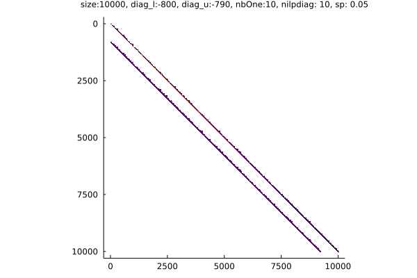
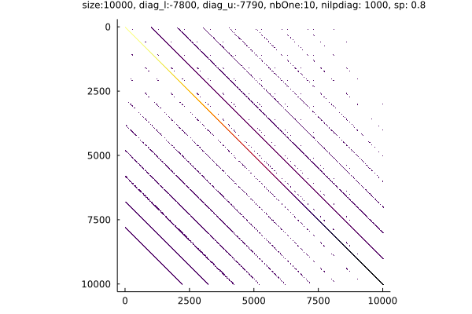
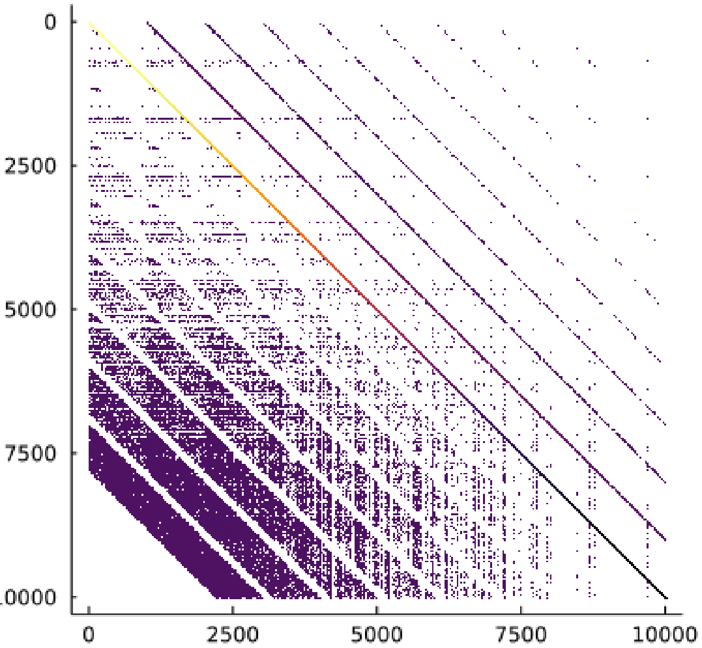
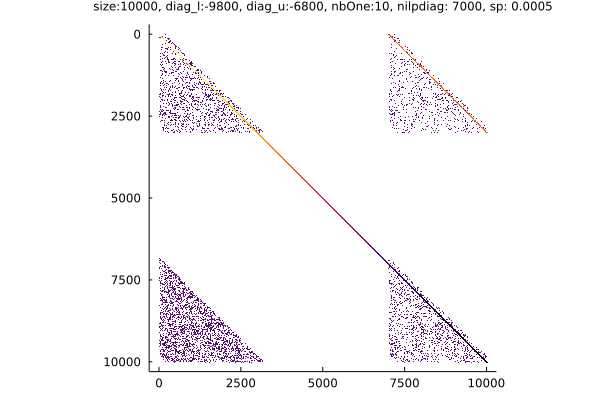
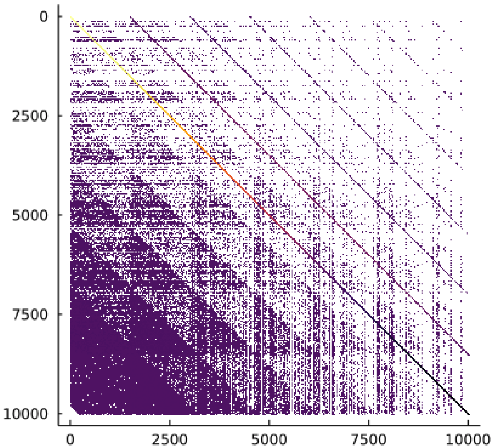
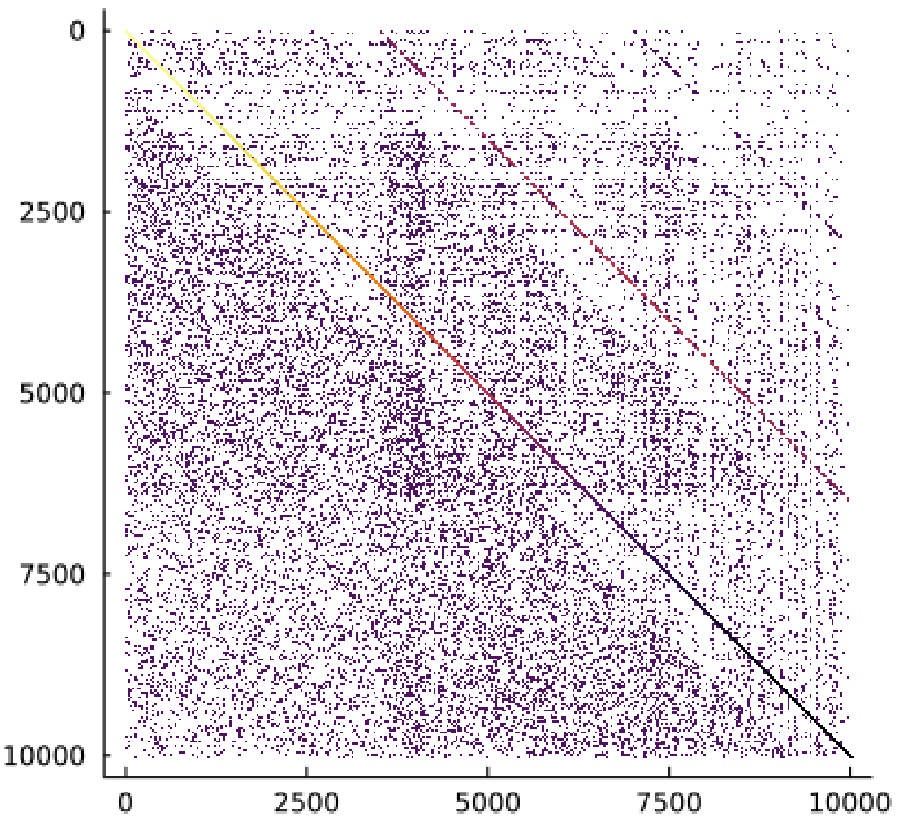

# Gallery: Some Sparsity Patterns

The different sparisty patterns shown in this section are generated by [Example: patterns.jl](https://github.com/SMG2S/SMG2S.jl/blob/main/examples/patterns.jl).
The parameters for each case are also listed together with the plots.


```
size: 10000, diag_l: -7800, diag_u: -7790, nbOne: 10, nilpdiag: 1000, sp: 0.0008
```


 
```
size: 10000, diag_l: -7800, diag_u: -7790, nbOne: 10, nilpdiag: 100, sp: 0.05
```


```
size: 10000, diag_l: -800, diag_u: -790, nbOne: 10, nilpdiag: 100, sp: 0.05
```


```
size: 10000, diag_l: -800, diag_u: -790, nbOne: 10, nilpdiag: 10, sp: 0.05
```



```
size: 10000, diag_l: -7800, diag_u: -6000, nbOne: 10, nilpdiag: 7000, sp: 0.0008
```


```
size: 10000, diag_l: -7800, diag_u: -7790, nbOne: 10, nilpdiag: 1000, sp: 0.8
```



```
size: 10000, diag_l: -7800, diag_u: -7000, nbOne: 20, nilpdiag: 1000, sp: 0.005
```



```
size: 10000, diag_l: -1800, diag_u: -10, nbOne: 1000, nilpdiag: 1000, sp: 0.0005
```


```
size: 10000, diag_l: -9800, diag_u: -6800, nbOne: 10, nilpdiag: 7000, sp: 0.0005
```



```
size: 10000, diag_l: -9800, diag_u: -6800, nbOne: 20, nilpdiag: 1500, sp: 0.004
```



```
size: 10000, diag_l: -9800, diag_u: -6800, nbOne: 70, nilpdiag: 1500, sp: 0.004
```


```
size: 10000, diag_l: -9900, diag_u: -800, nbOne: 70, nilpdiag: 3500, sp: 0.0008
```


